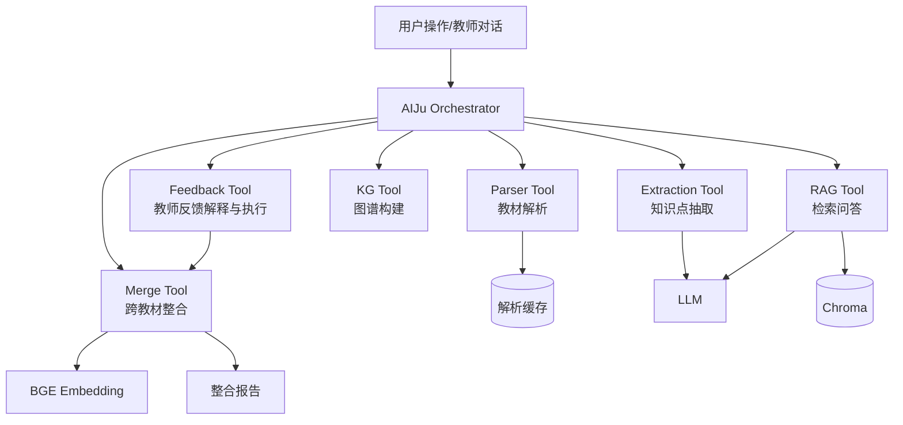

# Agent 架构说明

## 1. 架构总览

AIJu 首版采用“单 Orchestrator + 多工具模块”的 Agent 架构。Orchestrator 负责维护任务状态、调用顺序和失败降级；工具模块负责确定性工作。这样既满足 Agent 架构说明要求，又避免在 5 小时内引入 CrewAI、AutoGen 或 LangGraph 的额外复杂度。

## 2. 职责划分

| 模块 | 职责 | 输入 | 输出 |
|---|---|---|---|
| Orchestrator | 安排调用链路、维护状态、聚合错误 | 用户请求、会话状态 | 任务结果、进度、错误 |
| Parser Tool | 文件解析、章节识别、页码和字数统计 | PDF/MD/TXT/DOCX | `TextbookSummary` |
| Extraction Tool | LLM 抽取知识点和关系 | `Chapter` | `KnowledgeNode` / `KnowledgeEdge` |
| KG Tool | 图谱去重、样式字段、前端 JSON | 节点和边 | `KnowledgeGraph` |
| Merge Tool | 语义对齐、合并/保留/删除决策、压缩控制 | 多本图谱 | `IntegrationResult` |
| RAG Tool | chunk、embedding、检索、引用回答 | 章节、问题 | `RagQueryResponse` |
| Feedback Tool | 理解教师修改意图并更新决策 | 对话消息、决策 ID | 更新后的整合结果 |

## 3. 为什么不用多 Agent 框架

本赛题时间只有 5 小时，评分重点是功能闭环、引用可信、文档论证和工程可复现。多 Agent 框架适合复杂异步协作，但首版会带来额外风险：

- 框架状态机和回调调试成本高。
- LLM token 成本更难控。
- 每个 Agent 的输出仍需严格 Pydantic 校验。
- 赛题验收更关注结果可解释，而非 Agent 数量。

因此首版选择手写 Orchestrator，把复杂度留在明确的服务边界中。后续若时间充足，可把每个工具模块迁移为 LangGraph node。

## 4. 数据流与调用链路

完整链路：

1. 用户上传教材。
2. Parser Tool 输出章节结构。
3. Extraction Tool 对每章抽取节点和边。
4. KG Tool 合成单本教材图谱。
5. Merge Tool 对多本图谱做 embedding 对齐和 LLM 校验。
6. RAG Tool 对章节正文建立 chunk 索引。
7. 用户提问时 RAG Tool 返回带引用答案。
8. 教师在对话中提出修改，Feedback Tool 转换为决策更新。
9. Merge Tool 重算整合结果，Report Tool 更新报告统计。

关键接口：

- `POST /api/graph/build`: 从教材 ID 列表到图谱。
- `POST /api/integration/run`: 从图谱到整合决策。
- `POST /api/integration/feedback`: 从教师反馈到新决策。
- `POST /api/rag/query`: 从问题到带引用回答。

## 5. Prompt 工程

知识抽取 Prompt 约束：

- 每次只处理一个章节或一个 chunk（截取前 6000 字）。
- 输出严格 JSON，使用 `response_format={"type": "json_object"}`。
- 节点必须包含 `name`、`definition`、`category`。
- 关系类型只能从白名单选择：prerequisite、parallel、contains、applies_to。
- 若章节没有可抽取知识点，返回空数组。
- 含 few-shot 示例（炎症/变质/渗出/增生），引导模型输出规范格式。
- 失败重试一次，仍失败则降级为启发式正则抽取。

RAG 回答 Prompt 约束：

- 只能基于提供上下文回答。
- 每个结论都尽量绑定来源。
- 引用格式固定为 `[教材名称, 第X章, 第X页]`。
- 找不到答案时返回“当前知识库中未找到相关信息”。

防幻觉策略：

- 只把检索 chunk 放入上下文。
- 要求模型先判断上下文是否足够。
- 引用来自 chunk 元数据，不让模型自由编造来源。
- 输出经 schema 校验，缺引用则降级返回无法回答。

## 6. 取舍与替代方案

| 方案 | 是否采用 | 原因 |
|---|---|---|
| 单一大 Prompt 完成全部整合 | 不采用 | 上下文过长，失败后难恢复 |
| CrewAI/AutoGen 多 Agent | 首版不采用 | 框架集成和调试成本高 |
| LangGraph 状态机 | 后续增强 | 适合任务状态复杂后迁移 |
| RAGFlow/LightRAG fork | 不采用 | 完整产品过重，赛题定制成本高 |
| 手写 Orchestrator | 采用 | 边界清晰、容易解释、便于验收 |

## 7. 创新点

- 图谱整合和 RAG 共用章节解析结果，避免重复处理教材。
- 整合决策可被教师自然语言覆盖，形成“AI 初稿 + 教师定稿”的教学工作流。
- 压缩比不是简单删除字符，而是结合频次、中心性和依赖链保护教学完整性。
- 后续 Benchmark 可量化 chunk 大小、embedding 模型、是否 rerank 对引用准确率的影响。

## 8. 已知局限与改进

已知局限：

- 首版依赖云端 LLM，网络和 API Key 会影响演示。
- 医学同义词表初始覆盖有限。
- PDF 图表区域和 OCR 文本暂不做深度处理。
- embedding 使用 hash 向量 fallback，BGE 模型需单独安装。

已实现改进：

- LLM 知识抽取已实现，含 few-shot 示例和重试策略。
- 跨教材整合已实现 embedding 语义对齐 + LLM 等价判定。
- 教师反馈闭环已实现，支持拆分/保留/合并/恢复操作。
- RAG 已集成 ChromaDB 持久化，支持 BGE embedding（需安装 sentence-transformers）。

后续改进方向：

- 引入 LangGraph 管理长任务状态和重试。
- 使用 rerank 模型提升引用准确率。
- 引入 OCR 和版面分析提升扫描 PDF 解析能力。
- 构建 20-50 个 RAG Benchmark 问题，用数据指导参数选择。
