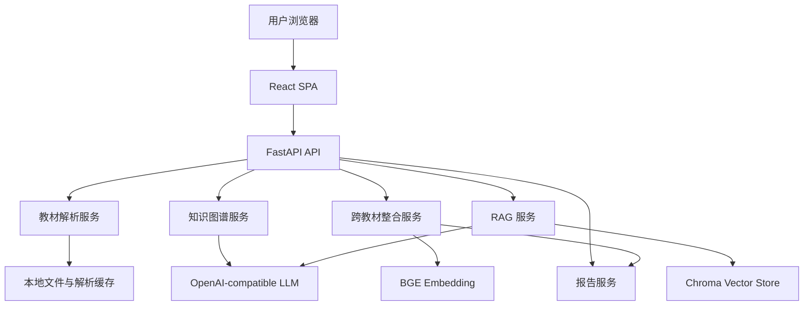

# 系统设计

## 1. 架构概览



首版采用“模块化服务 + 确定性 Orchestrator”，不用重 Agent 框架。这样最适合 5 小时交付：接口稳定、调试直接、文档容易解释。后续可把服务编排升级为 LangGraph 状态机。

## 2. 技术选型

| 层级 | 选型 | 理由 |
|---|---|---|
| 后端 | FastAPI | 文件上传、异步接口、OpenAPI 文档生成快 |
| 前端 | React + Vite | 开发速度快，适合单页三栏工作台 |
| 图谱 | Cytoscape.js | 支持图交互、布局、样式映射和大规模节点 |
| PDF | PyMuPDF | 可逐页解析，能读取文本块、字体和位置信息 |
| 多格式 | MarkItDown | 快速补齐 DOCX/Excel/HTML 到 Markdown |
| 向量库 | Chroma | 轻量持久化，元数据过滤方便 |
| Embedding | BGE-small-zh | 中文语义检索与概念对齐表现稳定 |
| LLM | OpenAI-compatible API | 可切换 OpenAI、DeepSeek、通义等服务 |

当前实现包含一个轻量 RAG fallback：用本地哈希向量 + BM25 混合检索完成无模型下载的索引和问答；配置 `OPENAI_API_KEY` 后，回答生成自动切换为 OpenAI-compatible LLM。后续可将哈希向量替换为 BGE/Chroma 持久化。

## 3. 数据流

1. 上传教材
   - 前端 `POST /api/textbooks/upload`。
   - 后端保存到 `data/uploads/`，返回 `TextbookSummary`。

2. 解析教材
   - 前端触发 `POST /api/textbooks/{id}/parse`。
   - 后端逐页解析，过滤页眉页脚，识别章节。
   - 输出 `Chapter[]`，并持久化到解析缓存。

3. 构建图谱
   - 前端触发 `POST /api/graph/build`。
   - 每章调用 LLM 抽取 `KnowledgeNode[]` 和 `KnowledgeEdge[]`。
   - 前端使用 Cytoscape.js 渲染。

4. 跨教材整合
   - 前端触发 `POST /api/integration/run`。
   - embedding 召回候选重复节点，LLM 判定临界样本。
   - 输出 `MergeDecision[]`、整合后图谱、压缩比。

5. RAG 问答
   - `POST /api/rag/index` 将章节切为 chunk 并入库。
   - `POST /api/rag/query` 检索 top-5 chunk，LLM 生成带引用答案。

6. 教师反馈
   - `POST /api/integration/feedback` 接收自然语言指令。
   - 解析为保留、拆分、合并、恢复等操作。
   - 更新整合决策、图谱和报告摘要。

## 4. 数据模型

核心 Pydantic 类型在 `backend/app/models/schemas.py`：

- `TextbookSummary`: 教材文件、格式、大小、解析状态、章节。
- `Chapter`: 章节 ID、标题、起止页、正文、字符数。
- `KnowledgeNode`: 知识点名称、定义、类别、来源章节、页码、频次。
- `KnowledgeEdge`: 起点、终点、关系类型、说明。
- `MergeDecision`: 决策类型、影响节点、结果节点、理由、置信度。
- `RagQueryResponse`: 回答、引用列表、原文 chunk。

## 5. 存储设计

首版本地文件存储：

- `data/uploads/`: 用户上传文件。
- `data/cache/parsed/`: 章节解析 JSON。
- `data/cache/graph/`: 单本教材图谱 JSON。
- `data/cache/integration/`: 整合决策 JSON。
- `data/chroma/`: 向量库持久化。

这些目录全部被 `.gitignore` 排除。

## 6. 前端设计

页面采用单页三栏：

- 左侧：教材上传、文件列表、解析状态。
- 中间：知识图谱主画布，占最大空间。
- 右侧：Tab 面板，包含整合、RAG、对话、报告。

图谱视觉映射：

- 节点颜色：教材来源。
- 节点大小：跨教材出现频次。
- 边颜色/线型：关系类型。
- 点击节点：显示定义、章节、页码和原文。
- 搜索：高亮匹配节点。

## 7. 部署设计

本地开发：

```bash
uvicorn app.main:app --reload --app-dir backend --port 8000
npm run dev:frontend
```

Docker：

```bash
docker compose up --build
```

公网部署建议：

- 魔搭创空间：后端与前端同容器或以静态构建服务。
- Vercel + Railway：前端部署 Vercel，后端部署 Railway，设置 `VITE_API_BASE`。

## 8. 已知限制

- 当前代码是可运行骨架，解析、LLM、Chroma 逻辑仍需按文档实现。
- 全量 7 本教材 LLM 抽取成本高，需要缓存和限速。
- 若 PDF 无文本层，需要 OCR 增强，首版只标记失败。
